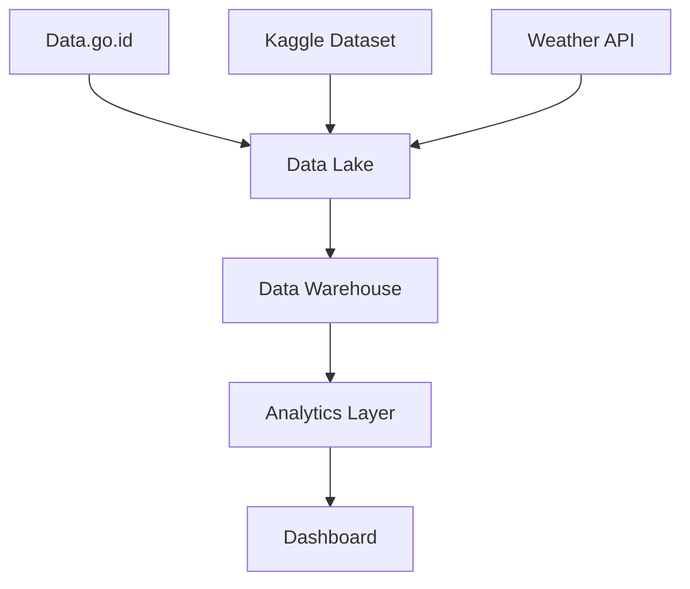

# CV Evaluation and Job Recommendation System

## Project Information
**Project Name:** CV Analyzer and Job Recommendation System  
**Created By:** Data Engineering Team Two  
**Date:** February 18, 2026  
**Version:** 1.0  

---

# 1. Executive Summary

## 1.1 Project Overview

### Tujuan Project
Mengembangkan model **Machine Learning** untuk membantu mahasiswa, fresh graduate, dan job seeker menilai apakah CV berbasis **ATS (Applicant Tracking System)** yang mereka upload telah sesuai dengan standar industri serta memberikan rekomendasi pekerjaan yang sesuai dengan profil CV.

Sistem juga dapat digunakan oleh **Human Resource (HR)** untuk membantu proses evaluasi CV secara otomatis.

### Scope Project
Integrasi data lowongan kerja, data kebutuhan keterampilan industri, dan standar kompetensi pekerjaan untuk analisis kesesuaian CV terhadap kebutuhan industri serta rekomendasi pekerjaan berbasis **Machine Learning**.

### Expected Outcomes
- Sistem analisis kesesuaian CV dengan standar industri
- Model machine learning untuk rekomendasi pekerjaan
- Sistem identifikasi **skill gap** dari CV pengguna
- Dashboard analitik kebutuhan keterampilan industri

### Timeline
**3 bulan (Maret – Mei 2026)**

---

## 1.2 Stakeholders

### Project Owner
Institusi Pendidikan / Akademik *(Simulasi Project)*

### Team Members
- **Data Engineer:** Irham Najib Azimul Qowi  
- **Data Analyst:** Andrian Maulana  
- **Project Manager:** Muhammad Raufa Hafid Widodo  

### End Users
- Mahasiswa dan fresh graduate
- Job seeker
- Human Resource (HR)
- Perusahaan dan industri

---

# 2. Data Source Analysis

## 2.1 Dataset Kaggle

### Source Details
**Dataset Name:** LinkedIn Job Postings (2023–2024)

**URL / Access Point:**  
https://www.kaggle.com/datasets/arshkon/linkedin-job-postings

**Creator / Publisher:** Kaggle Community  
**Last Update:** 2023  

### Data Analysis

**Format Data:** CSV  
**Size & Dimensions:** ± 1GB, jutaan baris data  

### Data Fields
- job_title
- company_name
- location
- job_description
- skills
- industry
- experience_level
- salary_range

### Quality Metrics
- **Missing Values:** ± 3% pada kolom skill
- **Data Types:** Properly formatted
- **Consistency:** High
- **Documentation Quality:** Good

---

## 2.2 Public APIs

### Source Details
**API Name:** Adzuna Job Search API  

**Endpoint URL:**  
https://developer.adzuna.com/overview  

**Provider:** Adzuna Ltd  

**Authentication Method:** API Key  

### API Analysis

- **Response Format:** JSON  
- **Rate Limits:** 1000 calls/day (free tier)  
- **Reliability:** High availability  
- **Documentation Quality:** Comprehensive  
- **Cost:** Free tier sufficient for project needs  

---

## 2.3 Open Research Data

### Source Details

**Dataset Name:** ONET Occupational Database  

**Repository:** ONET Resource Center  

**Research Institution:** U.S. Department of Labor  

**URL:**  
https://www.onetcenter.org/database.html  

**Publication Date:** Updated periodically  

### Data Analysis

**Format & Structure:** CSV, Excel, relational dataset  

**Data Volume:** ± 500MB  

### Data Fields
- occupation title
- skills requirement
- knowledge domain
- abilities
- work activities
- education requirement
- job task description

### Data Quality
High (official occupational research database)

### Citation Requirements
Open use for research and academic purposes

## 3. Data Flow Mapping

### 3.1 Data Integration Architecture

### 3.2 ETL Process Design

- **Extraction Methods**:
  - Data.go.id: Monthly batch download
  - Kaggle: One-time bulk load
  - Weather API: Real-time streaming
- **Transformation Rules**:
  - Standardize timestamps to UTC+7
  - Geocode station locations
  - Normalize weather conditions
- **Loading Procedures**:
  - Incremental loads for streaming data
  - Full refresh for monthly batches
- **Scheduling**:
  - Weather data: Every 5 minutes
  - Usage data: Daily at 00:00
  - Statistics: Monthly at 1st

%% System Architecture Diagram
graph TD
subgraph Data Sources
A[Data.go.id] --> ETL
B[Kaggle Dataset] --> ETL
C[Weather API] --> ETL
D[Research Data] --> ETL
end

subgraph Data Processing
    ETL[ETL Layer]
    DL[(Data Lake)]
    DW[(Data Warehouse)]
    ETL --> DL
    DL --> DW
end

subgraph Analytics
    AN[Analytics Engine]
    DS[Data Science Models]
    DW --> AN
    DW --> DS
end

subgraph Applications
    API[REST API]
    DASH[Dashboard]
    AN --> API
    DS --> API
    API --> DASH
end
%% ETL Workflow
sequenceDiagram
participant S as Source Systems
participant E as Extraction
participant T as Transformation
participant L as Loading
participant DW as Data Warehouse

S->>E: Raw Data
E->>T: Extracted Data
T->>L: Transformed Data
L->>DW: Loaded Data
---

**Kita ingin menganalisis hubungan antara tingkat pendidikan, pengangguran, dan pendapatan di suatu negara.**

**Dataset:**

* **World Bank Open Data:** Data tentang tingkat pendidikan ([https://data.worldbank.org/](https://www.google.com/url?sa=E&q=https%3A%2F%2Fdata.worldbank.org%2F))
* **ILOSTAT:** Data tentang tingkat pengangguran ([https://ilostat.ilo.org/](https://www.google.com/url?sa=E&q=https%3A%2F%2Filostat.ilo.org%2F))
* **Our World in Data:** Data tentang pendapatan per kapita ([https://ourworldindata.org/](https://www.google.com/url?sa=E&q=https%3A%2F%2Fourworldindata.org%2F))

